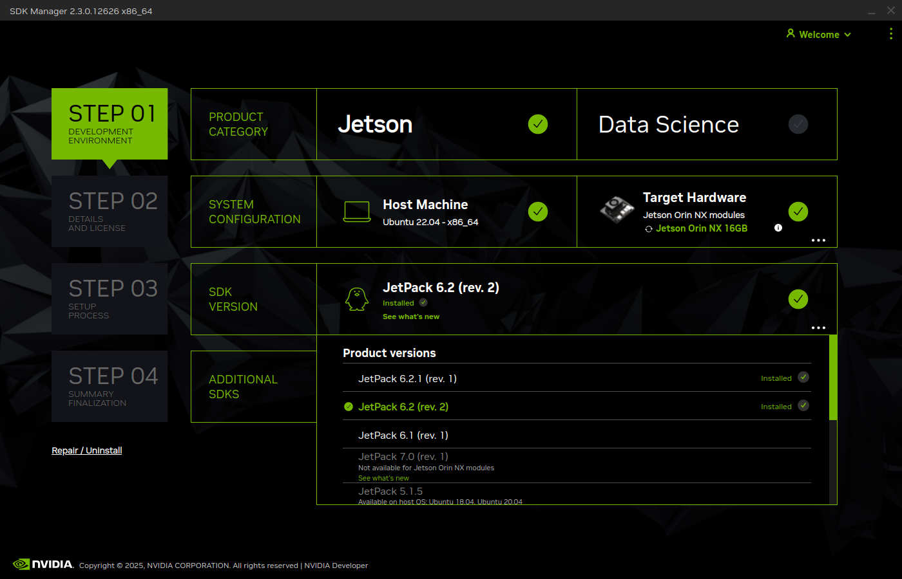
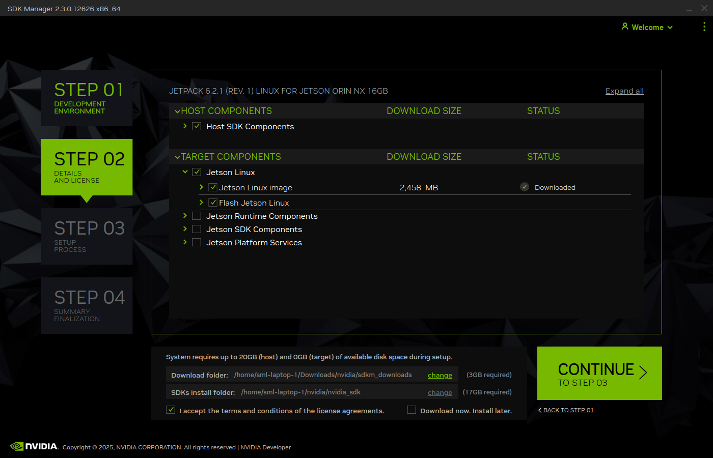
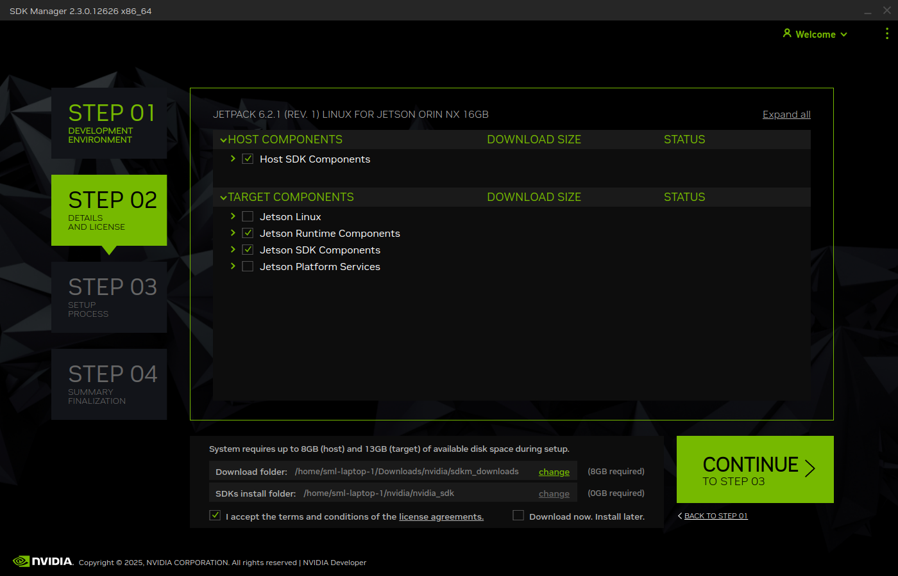

# Jetson OS and CUDA Setup
This tutorial encopases all that is needed to install Linux operating system with ConnectTech support packages
## Table of Contents
- [Before Installation](#before-installation)
- [Flashing Jetson with the Operating System](#flashing-jetson-with-the-operating-system)
- [Configuring Internet Access](Jetson_internet.md)
- [Installing Nvidia SDK](#installing-nvidia-sdk)
- [Software Setup After Installation](#software-setup-after-installation)

## Before Installation
Before we can begin the installation process, we need to install [Nvidia SDK Manager](https://developer.nvidia.com/sdk-manager). This step requires an active Nvidia account and unfortunately cannot be skipped.

1. Enable the recovery mode on the Jetson. To enable the recovery mode follow the steps described in the [manual](https://connecttech.com/ftp/pdf/CTIM-00095_Boson_Boson22_Manual.pdf). In short, connect the Jetson to its power supply, press and hold the recovery button (SW3) and press-release the reset button (SW2). When in the recovery mode the cooling fan should remain spinning.

2. Connect the Jetson using USB C to your computer.

## Flashing Jetson with the Operating System
1. Open Nvidia SDK Manager.

2. Select Jetpack 6.2 rev. 2 (it can be hidden under all versions button).
    

    
    

3. Select the following modules to be installed:
    

    
    

4. After downloading the modules, on the prompt to flash the board, press skip.
5. Download a suitable [CTI support package for Jetpack 6.2](https://connecttech.com/resource-center/l4t-board-support-packages/) (DO NOT download RealTime OS), or use this [direct link to the package](https://connecttech.com/ftp/Drivers/CTI-L4T-ORIN-NX-NANO-36.4.3-V009.tgz).
6. Unzip the support package archive and make sure the top-most folder is called <strong>CTI-L4T</strong> and place it here: <code>/home/$USER/nvidia/nvidia_sdk/JetPack_6.2_Linux_JETSON_ORIN_NX_TARGETS/Linux_for_Tegra</code> where <strong>$USER</strong> is your account username.

7. From terminal, go into <strong>CTI-L4T</strong> directory and execute \
    <code>sudo chmod +x install.sh</code> \
    <code>sudo ./install.sh</code> \
    <code>cd ..</code> \
    <code>sudo ./cti-flash.sh</code> \
8. When prompted, select the appropriate settings for the current board (Orin NX on Boson extension board with default base configuration).

## Configuring Internet Access
To proceed with the configuration, we have to enable Internet access. One way of doing this is to connect the Jetson with an ethernet cable to the local network and using one of the monitors in the lab to proceed with the basic Linux user setup. After that is complete, open the terminal and get the assigned IP address using the command:

<code>hostname -I</code>

For configuring the Internet access with the tether attached, see [Getting internet access to Jetson via tether](Jetson_internet.md).

## Installing Nvidia SDK
After having configured the Internet access, we can proceed with the installation of Nvidia graphics card drivers.
1. Open Nvidia SDK Manager.
2. Proceed with the same selection as in [Flashing jetson with the Operating System](#flashing-jetson-with-the-operating-system) until module selection.
3. In the module selection, select the following:
    

    
    

4. After the download is complete, continue to flashing the device.
5. Select flashing over ssh and fill-in the IP address, username, and password. <strong>TIP!</strong> If by chance there are <code>apt</code> errors, ensure that the system date is set correctly to the current date.
6. We can verify whether CUDA has been sucessfully installed by running:

<code>nvcc --version</code>

## Software Setup After Installation
To install the development software, clone this repository onto Jetson or paste the contents of <code>BlueROV_Jetson_setup.sh</code> into a new file.

<code>sudo chmod +x BlueROV_Jetson_setup.sh</code>\
<code>sudo ./BlueROV_Jetson_setup.sh</code>
