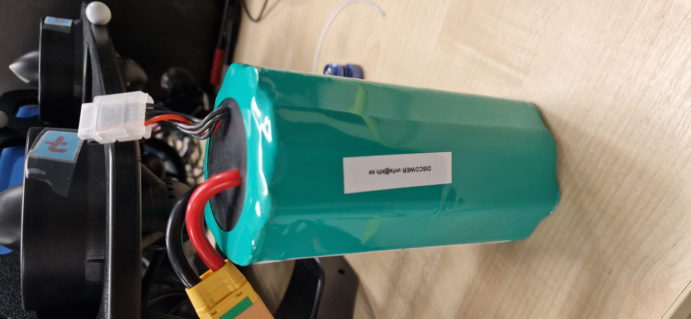
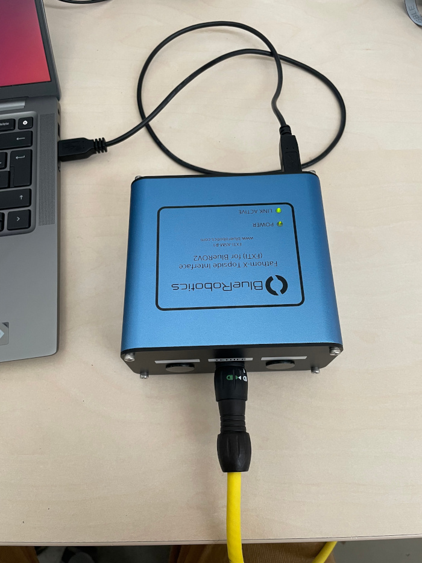
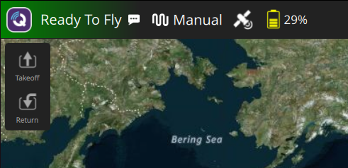
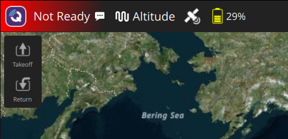
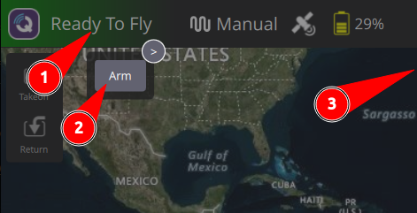
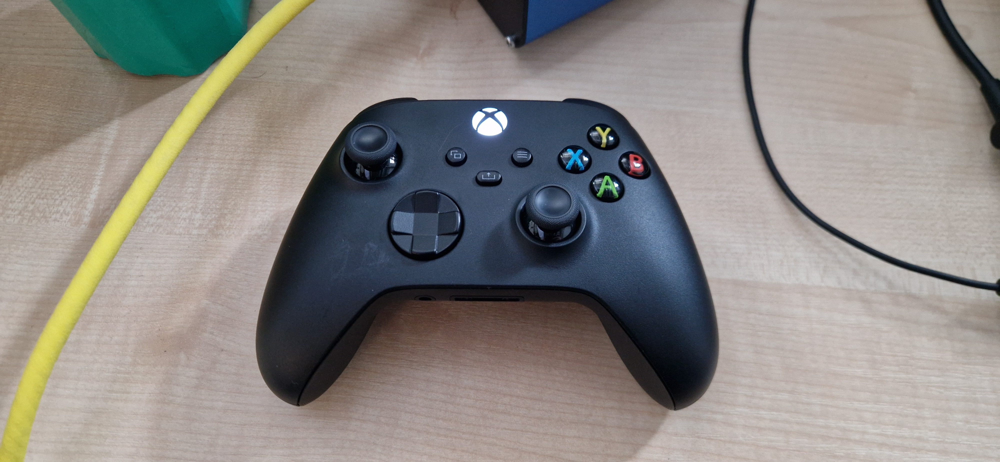
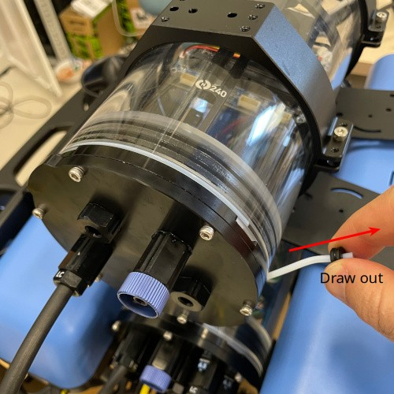
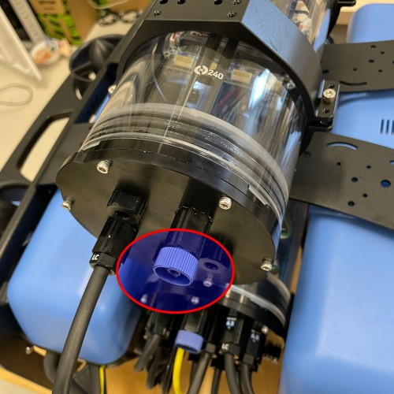
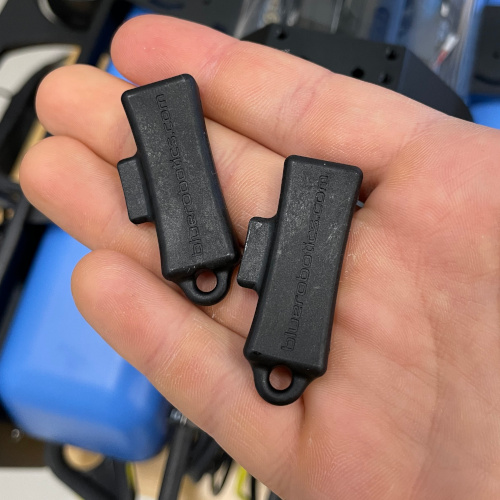
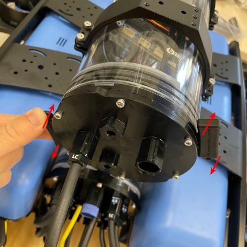

# Quick tutorial

This is a short tutorial on how to use the BlueROVs. We recommend first doing the SITL gz simulator setup in [SITL Simulation setup](sim_setup.md).

## Table of Contents
- [Open and close the tubes](#open-and-close-the-tubes): Open and close the BlueROV, e.g. for loading batteries
- [Operate in manual mode](#operate-in-manual-mode): Establish connection to robot, arm the robot, manual steering
- [Connect to Jetson](#connect-to-jetson): Connect your PC/laptop to the Jetson
- [Start PX4/ROS communication](#start-px4ros-communication): Establish the bridge between PX4 messages and ROS messages. Allows to record data/control over ROS/...

## Operate in manual mode

1. Setup: If not already happened, 
- Install QGroundControl from the official resources
- Make sure to follow the user-side setup in [PX4_setup.md](PX4_setup.md).

> [!NOTE]
> If you are operating **Bubble** (the BlueROV2 without the extra tube with the stereo d435i cam and the Jetson) ignore all the instructions from the [Connect to Jetson](#connect-to-Jetson) all the way to the end. 

2. Connect the battery to the XT90 connector (check the [Open and close the tubes](#open-and-close-the-tubes) section to know how open the tube where it resides). Make sure to hear the two difference notes with a space of about 3s of silence in between, if you only hear a continuous song the BlueROV2 has not started the ESCs correctly and you need to unplug and plug the battery again. Another way to see if it has started correctly is that the PX4 should have two continuous lights, a green and an orange one.
<p align="center">
  
</p>

3. Connect the Fathom-X Interface with a USB port on your computer on the one side and with the BlueROV tether on the other.

<p align="center">
  
</p>

4. Open QGroundControl. After a short while, the robot should be connected and it should look like this:



> [!NOTE]
> It might also look like this:
>
> 
> 
> You can most probably ignore this warning. If not, QGroundControl will give you a helpful error during arming.
> 
> <details> <summary>Reason for warning:</summary> This can happen as no "classical" radio remote control is configured - we use the BlueROV only via QGroundControl and Joystick. You can ignore the red "Not Ready" therefore, the vehicle is connected anyways. To verify that this is the reason for the warning, go to "Q">"Vehicle Configuration". Everything should be green besides of "Radio". </details>

If the robot is not connected after some time, remove and re-plug the USB connection. If the issue persists, check your network setup.

5. Plug in the joystick, arm the vehicle and have fun! If you are connected, but something is not working, go to "Q">"Vehicle Configuration" and resolve the issues (most likely you need to tick the Enable joystick box in the Joystick tab).

To arm the vehicle, make sure that "Manual" mode is selected from the dropdown in the top bar. Then, click the following:

<p align="center">
   
</p>

We also strongly recommend to setup an arm (button 6 in xbox) and a disarm (button 4 in xbox) button before any operations so you can safely and quickly disarm it if needed. This can be setup in Vehicle Configuration > Joystick > Button Assignment.

Connecting the Xbox controller through Bluetooth is also always recommended to reduce the number of cables in the tank. To do so you need to first turn the controller (maintain press on the Xbox symbol - turning it off is done by a longer maintain press) and put it in binding mode (press the smaller button on the top of the controller). You should then be able to see and pair it using common Ubuntu Bluetooth window. If you are experiencing issues we recommend installing the [xpad-neo](https://github.com/atar-axis/xpadneo) driver and updating the firmware in the controller (through the Windows Xbox app). To test it works you can use the [gamepad testet](https://hardwaretester.com/gamepad).

> [!NOTE]
> Other people might bind your controller while you are away and you will need to re-pair it again afterwards, if you are seeing your controlling connecting and disconnecting from Bluetooth really fast, you need to re-pair.

<p align="center">
   
</p>

For control over ROS, you need to [start ROS communication](#start-px4ros-communication) and change the mode to "offboard". **NOTE that for Bubble we use a different connection setup.**

## Connect to Jetson

1. See steps 1 and 2 above. 

2. Verify that you have a connection to the robot by opening QGroundControl or 
```
ping 192.168.0.<your robots IP>
```

3. Connect to the Jetson over SSH via
```
ssh discower@<jetson_IP>
```
for user and PW 'discower'.

4. Optional: Start all ROS services, e.g. start the Intel RealSense node.
```
ros2 run realsense2_camera realsense2_camera_node
```

> [!NOTE]
> The Jetson has by default no access to the internet. Refer to [PX4_setup.md](PX4_setup.md) for more information regarding package installation etc.

## Start PX4/ROS communication

PX4 and ROS2 can communicate using the [MicroXRCE-DDS client](https://docs.px4.io/main/en/ros2/user_guide#installation-setup). The client should already be installed on the Jetson. Once it is started, you can see all PX4 topics in ROS and command the robot from ROS. Start the connection like this:

1. SSH to the Jetson and call
```
MicroXRCEAgent udp4 -p 8888
```
2. In QGroundControl, go to "Q">"Analyze Tools">"MAVLink Console" and call
```
uxrce_dds_client start -t udp -p 8888 -h <JETSON_IP>
```

You can test your connection using `ros2 topic list`.

## Open and close the tubes

**Opening the tubes**

1. Remove the locking chord

<p align="center">
  
</p>

2. Remove the pressure relief valve

<p align="center">
  
</p>

3. Detach the end cap with the black enclosure prying tool

<p align="center">
  
</p>

<p align="center">
  
</p>

**Closing the tubes**

Basically everything in reverse:

1. Make sure the pressure relief valve is detached
2. Press in the end cap. Make sure that no cable is damaged
3. Attach the pressure relief valve
4. Attach the locking chord. They come in different lengths depending on tube size.


