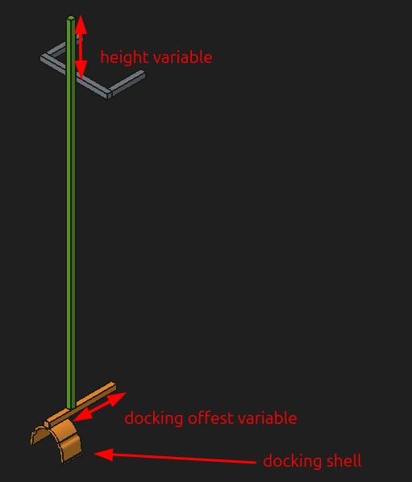
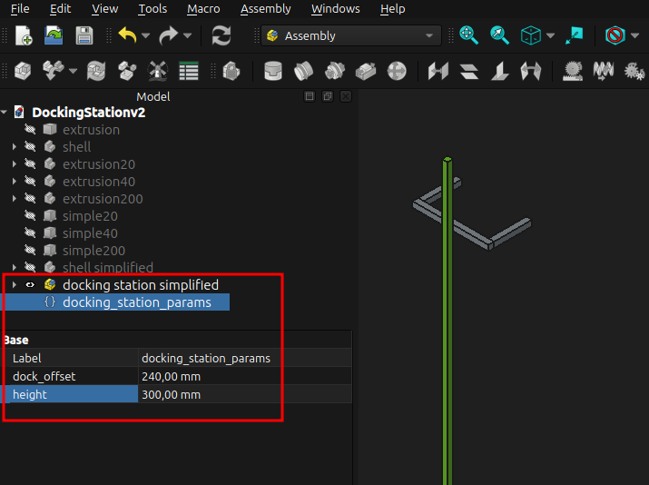

# Docking station

## Introduction

The docking station was made to allow for "parking" the BlueROVs (BROV) in the water tank. The assumption is that the robot is neutrally bouyant as this way it will flow up and press against the docking shell making it locked in space. The docking shell was made in such a way to allow both the BROV with the extra tube on top as well as the one without the extra tube to be able to dock in it. Admittedly, it is better for docking the BROVs with extra tube on top as it is fits better into the shell.

  

## Docking station installation in the tank

To install the docking station in the tank you can use the aluminum extrusions that can be found around the edge of the tank above the water level. Slot the docking station into the tank extrusion's ridge and tighten it using a hex key.

**TODO**: add an image showing the installation process

## Files

There are four different CAD files in different formats that can be used for your project [`.obj`](../STLs/docking_station/DockingStationv2.obj), [`.step`](../STLs/docking_station/DockingStationv2.step), [`.stl`](../STLs/docking_station/DockingStationv2.stl) and [`.FCStd`](../STLs/docking_station/DockingStationv2.FCStd).

## Customization

If you need to make any changes to this setup feel free to do so. The docking station was made in [FreeCAD](https://www.freecad.org/downloads.php). It's free, open source and supported on Windows, Mac and Linux. [`.FCStd`](STLs/docking station/DockingStationv2.FCStd) is its native file format and allows for the greatest freedom in customization as well as [exporting into various other file formats](https://www.xsim.info/articles/FreeCAD/en-US/HowTo/Supported-file-formats.html). Within that file you can also export and customize the inidvidual components of the docking station.

If you simply need to change the height and docking offest values you can do so by changing the VarSet values of the name `docking station params`.

  

Feel free to explore the CAD file. There are more variables for detailed adjustments of the docking shell, its dimensions as well as the aluminum extrusion arrangement.