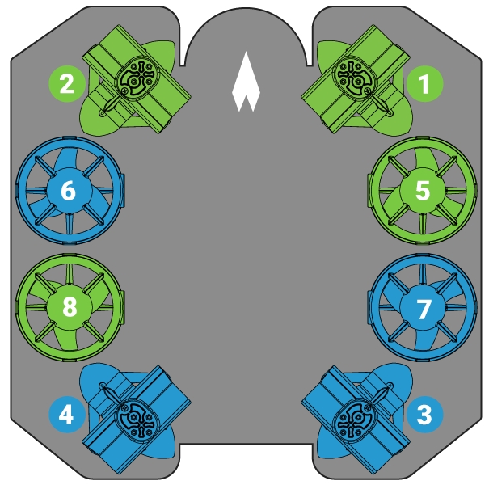
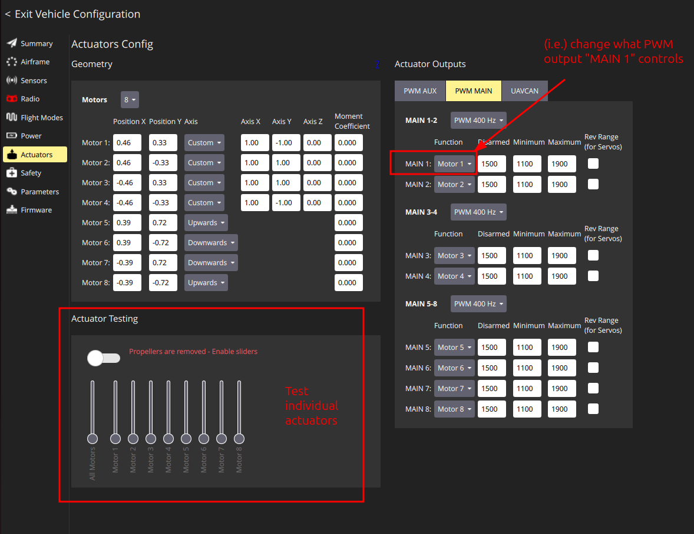

# Hardware Setup

This article is concerned with the internal setup of the robots. It is directed at everyone who wants to do own modifications on the hardware. For usage instructions, see [here](Usage.md).

The basic hardware setup follows the instructions by [Blue Robotics](https://bluerobotics.com/learn/bluerov2-assembly) (**Note:** Make sure to select the "Heavy configuration" when looking at the instructions.). In addition, some modifications have been made:

- Replaced flight controller from BlueRobotics/Raspberry Pi-based with PX4 Autopilot (Holybro PX6X)
- Added top tube
- Added Jetson Orin NX
- Added Intel Realsense
- Added network switch
- Software setup, not the scope of this page

The hardware instructions can still be useful for (e.g.)

- assembly of the battery tub and central tube
- how to make the robot waterproof (and test that it actually is)
- ESC setup
- how individual parts s.a. Fathom-X tether work
- ...

It is recommended to take a look at them!

## Overview

The BlueROV has three tubes:
1. Lowest:
	- Standard kit, unchanged
	- Contains battery
2. Mid:
	- Standard kit
	- Main "brain" of the robot: Contains all essential parts such as
		- Flight controller (PX6X)
		- ESCs
		- Tether interface
		- barometer, gyroscope (latter one built into PX6X)
		- ...
	- Tubes 1 and 2 are essential to control the robot in any way, even manual
	- Modification:
		- Added ethernet switch
		- Added a combined power/ethernet connection to the top tube
3. Upper:
	- Our own mod
	- Adding more autonomous capabilities through adding
		- Jetson Orin NX 16GB with [carrier board](https://connecttech.com/product/boson-for-framos-carrier-board-for-nvidia-jetson-orin-nx/)
		- Intel RealSense D435i

For a more detailed view, take a look at the wiring diagram.

## Wiring diagram

(to be added by Cezary)

## Motor setup

The motor assignments in PX4 follow the numbering of BlueRobotics:

  

💡 Help! I send the correct signal, but the wrong motors turn!

Let's say you want motor 1 and 2 to move and send an appropriate signal. Instead, motor 5 and 6 move.

In less evolved systems, you would need to make sure that the correct PWM output is connected to the correct motor. PX4, however, gives an easy way around this common problem:

Under `Q > Vehicle Setup > Actuators`, you can got to the 'PWN MAIN'/'PWM AUX' tab. For each PWM output, you can select a routing of the output in the dropdown, i.e. that 'MAIN 1:' is 'diabled', acts as 'Motor 1', ...

You can try out the current routing in the 'Actuator Testing' tab and move each motor individually. (Take care of your fingers and other vulnerable things. Also don't run the motors for too long, they are designed to operate in water and will overheat outside.)

  

## Vacuum testing

If new tubes / cables between tubes / ... are installed, a prelimiary vaccum test should be preformed. In general, the instructions from BlueRobotics [here](https://bluerobotics.com/learn/bluerov2-assembly/#preliminary-vacuum-test) can be followed. Make sure to

- Start with the equipment test. If the vacuum pump + connections themselves are not tight, try with zip ties.
- Test all tubes at the same time, otherwise it will not work. Combine as many T-formed hose connectors as you need to connect to all tubes.
- Disassemble the equipment after use: Over time, the hoses will otherwise take the shape of the connectors, so the pressure at the connection pieces decreases and they will start to leak air.
